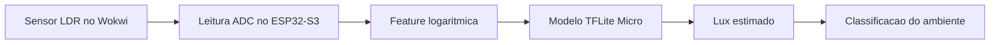
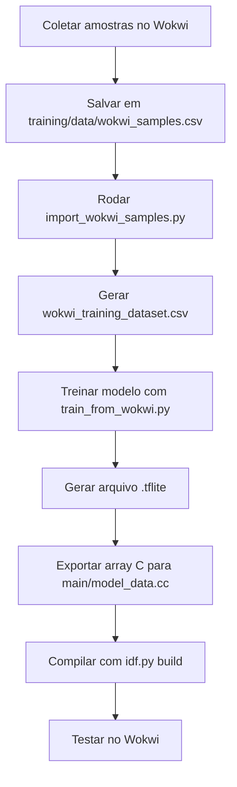
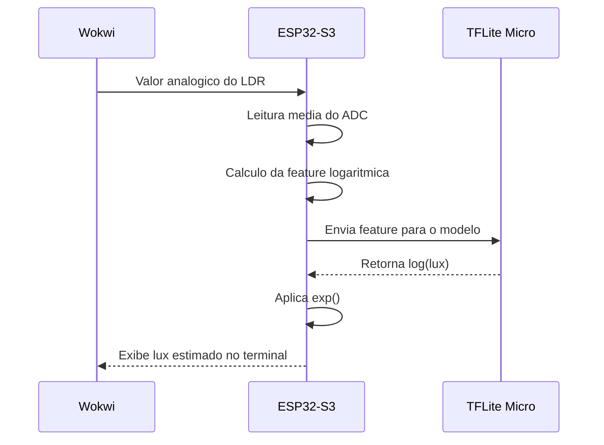

# Projeto II - Estimativa de Iluminacao com LDR no ESP32-S3

Este repositorio implementa o Projeto II da disciplina de IA Embarcada:

`Estimativa Reacional Regressiva Perceptiva Aplicada Sobre Iluminacao Residencial Dinamica`

O projeto usa um sensor LDR simulado no Wokwi e um ESP32-S3 com ESP-IDF para estimar iluminancia em lux a partir da leitura bruta do ADC. O fluxo completo inclui coleta de amostras, preparo do dataset, treino em TensorFlow, exportacao para TensorFlow Lite Micro e inferencia embarcada no firmware.


## Objetivo

Transformar a leitura analogica do LDR em uma estimativa calibrada de lux, usando um modelo pequeno o suficiente para rodar localmente no ESP32-S3 com TensorFlow Lite Micro.

## Tecnologias

- ESP32-S3
- ESP-IDF
- Wokwi
- Python
- Jupyter Notebook
- TensorFlow
- TensorFlow Lite Micro
- NumPy
- Pandas

## Estrutura de Pastas

```text
.
|-- assets/
|   `-- Captura-de-tela.png
|-- docs/
|   `-- Descricao do projeto final.pdf
|-- main/
|   |-- CMakeLists.txt
|   |-- idf_component.yml
|   |-- main.cc
|   |-- model_data.cc
|   `-- model_data.h
|-- training/
|   |-- artifacts/
|   |   |-- ldr_lux_model.tflite
|   |   |-- projeto_ii_wokwi_model.json
|   |   `-- wokwi_training_dataset.csv
|   |-- data/
|   |   |-- wokwi_samples.csv
|   |   `-- wokwi_samples_template.csv
|   |-- notebooks/
|   |   `-- projeto_ii_lux_regression.ipynb
|   |-- import_wokwi_samples.py
|   |-- README.md
|   |-- requirements.txt
|   |-- setup_env.ps1
|   `-- train_from_wokwi.py
|-- diagram.json
|-- README.md
`-- wokwi.toml
```

## Arquitetura do Projeto



## Fluxo de Desenvolvimento



## Fluxo de Inferencia no Firmware



## Como Funciona

1. O usuario ajusta o nivel de iluminacao do LDR no Wokwi.
2. O firmware le a saida analogica do sensor pelo ADC do ESP32-S3.
3. A leitura e convertida em uma feature logaritmica, que representa melhor a curva do LDR.
4. O modelo TFLite Micro recebe essa feature e retorna a estimativa de `log(lux)`.
5. O firmware converte a saida para lux e classifica o ambiente.

## Pipeline de Treino

Arquivos principais em `training/`:

- `setup_env.ps1`: cria o ambiente Python para treino
- `import_wokwi_samples.py`: transforma as amostras em dataset estruturado
- `train_from_wokwi.py`: treina o modelo TensorFlow e exporta o `.tflite` e o array C
- `notebooks/projeto_ii_lux_regression.ipynb`: notebook para exploracao, analise e ajuste

Preparacao do ambiente:

```powershell
.\training\setup_env.ps1
.\training\.venv-tf\Scripts\Activate.ps1
```

Geracao do dataset e exportacao do modelo:

```powershell
python .\training\import_wokwi_samples.py
python .\training\train_from_wokwi.py
```

Build do firmware:

```powershell
idf.py build
```

## Saidas Geradas

Depois do treino, o fluxo gera:

- `training/artifacts/wokwi_training_dataset.csv`
- `training/artifacts/ldr_lux_model.tflite`
- `training/artifacts/projeto_ii_wokwi_model.json`
- `main/model_data.cc`
- `main/model_data.h`

## Resultados

Alguns pontos de referencia observados com o modelo exportado:

- `1 lux` -> `1.07 lux`
- `20 lux` -> `20.86 lux`
- `100 lux` -> `103.08 lux`
- `1000 lux` -> `1009.59 lux`
- `10000 lux` -> `9937.99 lux`

Isso mostra que a calibracao ficou consistente em varias faixas de iluminacao, com boa aproximacao entre o valor de referencia e a estimativa embarcada.

## Observacoes

- O projeto usa TensorFlow Lite Micro no firmware.
- O modelo embarcado atual esta em `float32` para manter estabilidade no runtime do ESP32-S3.
- A dependencia `espressif/esp-tflite-micro` e resolvida automaticamente pelo ESP-IDF a partir de `main/idf_component.yml`.
