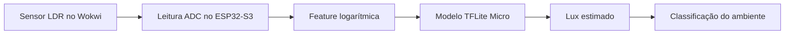
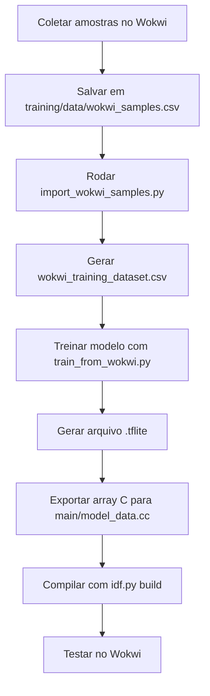

# Projeto II - Estimativa de Iluminação com LDR no ESP32-S3

Este repositorio implementa o Projeto II da disciplina de IA Embarcada:

`Estimativa Reacional Regressiva Perceptiva Aplicada Sobre Iluminação Residencial Dinâmica`

O projeto usa um sensor LDR simulado no Wokwi e um ESP32-S3 com ESP-IDF para estimar iluminância em lux a partir da leitura bruta do ADC. O fluxo completo inclui coleta de amostras, preparo do dataset, treino em TensorFlow, exportação para TensorFlow Lite Micro e inferência embarcada no firmware.


## Objetivo

Transformar a leitura analógica do LDR em uma estimativa calibrada de lux, usando um modelo pequeno o suficiente para rodar localmente no ESP32-S3 com TensorFlow Lite Micro.

## Tecnologias

- ESP32-S3
- ESP-IDF
- Wokwi
- Python
- Jupyter Notebook
- TensorFlow
- TensorFlow Lite Micro
- NumPy
- Pandas

## Estrutura de Pastas

```text
.
|-- assets/
|   `-- Captura-de-tela.png
|-- docs/
|   `-- Descricao do projeto final.pdf
|-- main/
|   |-- CMakeLists.txt
|   |-- idf_component.yml
|   |-- main.cc
|   |-- model_data.cc
|   `-- model_data.h
|-- training/
|   |-- artifacts/
|   |   |-- ldr_lux_model.tflite
|   |   |-- projeto_ii_wokwi_model.json
|   |   `-- wokwi_training_dataset.csv
|   |-- data/
|   |   |-- wokwi_samples.csv
|   |   `-- wokwi_samples_template.csv
|   |-- notebooks/
|   |   `-- projeto_ii_lux_regression.ipynb
|   |-- import_wokwi_samples.py
|   |-- README.md
|   |-- requirements.txt
|   |-- setup_env.ps1
|   `-- train_from_wokwi.py
|-- diagram.json
|-- README.md
`-- wokwi.toml
```

## Arquitetura do Projeto



## Fluxo de Desenvolvimento



## Fluxo de Inferência no Firmware


## Como Funciona

1. O usuário ajusta o nível de iluminação do LDR no Wokwi.
2. O firmware lê a saída analógica do sensor pelo ADC do ESP32-S3.
3. A leitura é convertida em uma feature logarítmica, que representa melhor a curva do LDR.
4. O modelo TFLite Micro recebe essa feature e retorna a estimativa de `log(lux)`.
5. O firmware converte a saída para lux e classifica o ambiente.

## Modelo Embarcado

O modelo utilizado é propositalmente pequeno, pois o comportamento do sensor ficou bem representado após a transformação logarítmica da entrada.

- tipo: `TensorFlow Lite Micro`
- precisão atual: `float32`
- entrada: `1 x 1`
- saida: `1 x 1`
- arquitetura: `Input(shape=(1,)) -> Dense(1)`
- parâmetros treináveis: `1 peso + 1 bias`
- tamanho do arquivo `.tflite`: cerca de `1072 bytes`

Na prática, o modelo aprende uma relação equivalente a:

`y = w*x + b`

onde:

- `x = log((4095 - adc_raw) / adc_raw)`
- `y = log(lux)`

e no firmware a estimativa final é obtida com:

`lux = exp(y)`

## Pipeline de Treino

Arquivos principais em `training/`:

- `setup_env.ps1`: cria o ambiente Python para treino
- `import_wokwi_samples.py`: transforma as amostras em dataset estruturado
- `train_from_wokwi.py`: treina o modelo TensorFlow e exporta o `.tflite` e o array C
- `notebooks/projeto_ii_lux_regression.ipynb`: notebook para exploração, análise e ajuste

Preparação do ambiente:

```powershell
.\training\setup_env.ps1
.\training\.venv-tf\Scripts\Activate.ps1
```

Geração do dataset e exportação do modelo:

```powershell
python .\training\import_wokwi_samples.py
python .\training\train_from_wokwi.py
```

Build do firmware:

```powershell
idf.py build
```

## Saídas Geradas

Depois do treino, o fluxo gera:

- `training/artifacts/wokwi_training_dataset.csv`
- `training/artifacts/ldr_lux_model.tflite`
- `training/artifacts/projeto_ii_wokwi_model.json`
- `main/model_data.cc`
- `main/model_data.h`

## Resultados

Alguns pontos de referência observados com o modelo exportado:

- `1 lux` -> `1.07 lux`
- `20 lux` -> `20.86 lux`
- `100 lux` -> `103.08 lux`
- `1000 lux` -> `1009.59 lux`
- `10000 lux` -> `9937.99 lux`

Isso mostra que a calibração ficou consistente em várias faixas de iluminação, com boa aproximação entre o valor de referência e a estimativa embarcada.

## Aplicabilidade da Arquitetura

Embora o protótipo utilize um LDR por simplicidade e disponibilidade no ambiente de simulação, o principal resultado do projeto está na arquitetura embarcada desenvolvida.

O fluxo implementado inclui:

- coleta de dados do sensor
- preparação e tratamento do dataset
- treino de modelo leve
- exportação para TensorFlow Lite Micro
- inferência embarcada no ESP32-S3

Essa arquitetura pode ser reaproveitada em outros contextos onde a leitura bruta do sensor não representa diretamente a grandeza de interesse e precisa de calibração ou modelagem.

Exemplos de aplicação:

- sensor de vazão calibrado
- umidade do solo
- sensores de gás
- sensores de pH
- automação residencial com sensores ambientais
- sistemas biomédicos, como glicosímetros, em nível conceitual

No caso de um glicosímetro, por exemplo, a ideia geral também envolve transformar um sinal bruto do sensor em uma estimativa útil. A diferença é que, no contexto biomédico, o problema é muito mais crítico, complexo e sujeito a validação clínica e regulatória. Ainda assim, o princípio arquitetural é semelhante.

## Observações

- O projeto usa TensorFlow Lite Micro no firmware.
- O modelo embarcado atual está em `float32` para manter estabilidade no runtime do ESP32-S3.
- A dependência `espressif/esp-tflite-micro` é resolvida automaticamente pelo ESP-IDF a partir de `main/idf_component.yml`.
