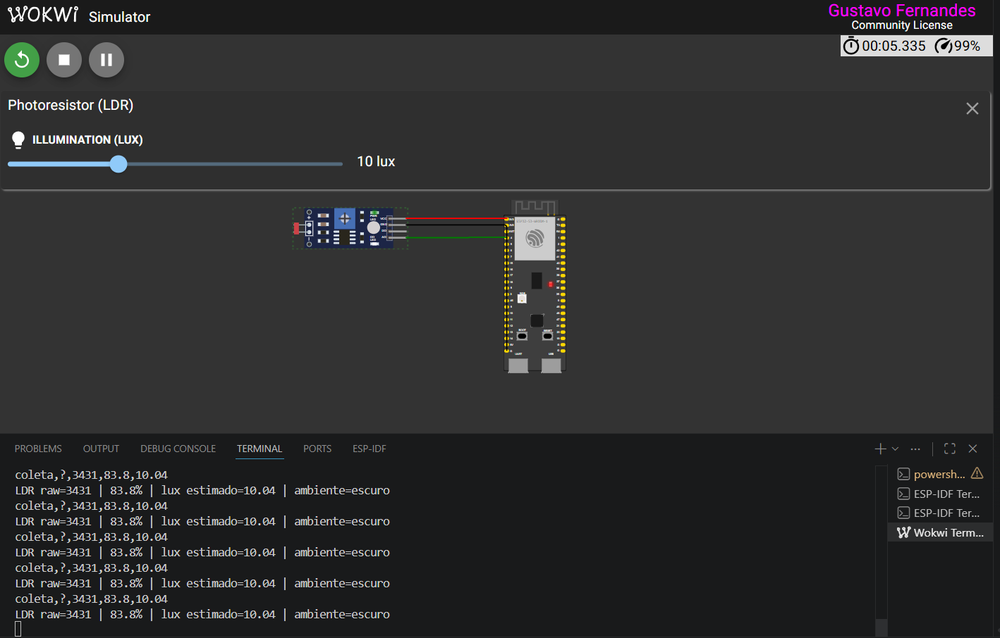

# Projeto II - Estimativa de Iluminacao com LDR no ESP32-S3

Este repositorio implementa o Projeto II da disciplina de IA Embarcada:

`Estimativa Reacional Regressiva Perceptiva Aplicada Sobre Iluminacao Residencial Dinamica`

O projeto utiliza um sensor LDR simulado no Wokwi e um ESP32-S3 com ESP-IDF para estimar iluminancia em lux a partir da leitura bruta do ADC. O fluxo inclui coleta de amostras, preparacao do dataset, treino de um modelo regressivo leve em Python e exportacao dos parametros para o firmware embarcado.



## Objetivo

Transformar a leitura analogica do LDR em uma estimativa de lux calibrada, usando um modelo matematico leve o suficiente para rodar diretamente no ESP32-S3 sem dependencias pesadas de TinyML no firmware.

## Tecnologias

- ESP32-S3
- ESP-IDF
- Wokwi
- Python
- Jupyter Notebook
- NumPy
- Pandas
- scikit-learn

## Estrutura

- `main/`: firmware da aplicacao embarcada
- `training/`: ambiente de treino, scripts e notebook
- `docs/`: documento de referencia do projeto
- `assets/`: imagens usadas na documentacao

## Fluxo do projeto

1. Coletar amostras no Wokwi com pares `lux_referencia` e `adc_raw`
2. Converter as amostras em dataset estruturado
3. Treinar o modelo com os dados reais do sensor
4. Exportar os parametros para `main/model_params.h`
5. Compilar e executar no ESP32-S3 simulado

## Pipeline de treino

Na pasta `training/` estao incluidos:

- `setup_env.ps1`: cria a virtualenv
- `import_wokwi_samples.py`: transforma as amostras coletadas em CSV de treino
- `train_from_wokwi.py`: treina o modelo real e exporta os parametros
- `notebooks/projeto_ii_lux_regression.ipynb`: notebook para exploracao e ajuste

Exemplo de uso:

```powershell
.\training\setup_env.ps1
.\training\.venv\Scripts\Activate.ps1
python .\training\import_wokwi_samples.py
python .\training\train_from_wokwi.py
```

## Resultados observados

Alguns pontos de validacao obtidos na simulacao:

- `1 lux` -> `1.17 lux`
- `20 lux` -> `20.86 lux`
- `100 lux` -> `103.08 lux`
- `1000 lux` -> `1009.59 lux`
- `10000 lux` -> `9938 lux`

Esses resultados mostram que a calibracao ficou consistente em varias faixas de iluminacao.

## Observacao tecnica

Embora o documento de referencia discuta abordagens com TinyML e TFLite Micro, este problema foi resolvido com uma regressao calibrada de baixa complexidade, o que se mostrou mais adequado ao comportamento do sensor e ao custo computacional do microcontrolador.
