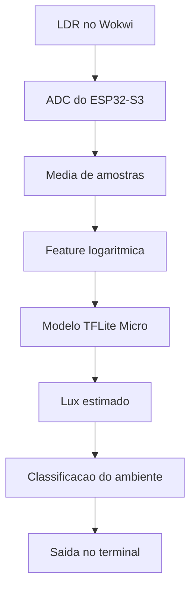

# Relatorio do Projeto II

## Tema

`Estimativa Reacional Regressiva Perceptiva Aplicada Sobre Iluminacao Residencial Dinamica`

## Visao Geral

Este projeto foi desenvolvido com o objetivo de estimar iluminancia em lux a partir da leitura analogica de um sensor LDR conectado a um ESP32-S3. A simulacao foi feita no Wokwi, enquanto o firmware foi implementado com ESP-IDF e a inferencia embarcada foi realizada com TensorFlow Lite Micro.

A proposta pratica do projeto foi transformar a leitura bruta do ADC em um valor util de iluminacao, aproximando o comportamento de um sistema de monitoramento residencial dinamico.

## Objetivo do Projeto

Os objetivos principais foram:

- coletar amostras reais do sensor no ambiente simulado
- montar um dataset a partir das medicoes
- treinar um modelo leve para prever lux
- exportar o modelo para o firmware embarcado
- executar a inferencia diretamente no ESP32-S3

## Sensor Utilizado

O sensor utilizado foi um `LDR` simulado no Wokwi.

### O que e um LDR

LDR significa `Light Dependent Resistor`. Trata-se de um componente cuja resistencia varia de acordo com a intensidade luminosa do ambiente.

No contexto do projeto:

- mais luz altera a saida analogica do modulo
- essa saida e lida pelo ADC do ESP32-S3
- o valor cru do ADC nao representa lux diretamente
- por isso foi necessario calibrar o sensor com dados coletados

### Ligacao no projeto

O sensor foi conectado ao `GPIO4`, correspondente ao `ADC1_CHANNEL_3` no ESP32-S3.

O firmware realiza varias leituras consecutivas e calcula uma media simples para reduzir oscilacoes.

## Estrutura do Codigo

A organizacao do projeto foi separada em duas partes principais:

- firmware embarcado
- ambiente de treino

```text
.
|-- main/
|   |-- main.cc
|   |-- model_data.cc
|   |-- model_data.h
|   |-- CMakeLists.txt
|   `-- idf_component.yml
|-- training/
|   |-- data/
|   |-- artifacts/
|   |-- notebooks/
|   |-- import_wokwi_samples.py
|   |-- train_from_wokwi.py
|   |-- requirements.txt
|   `-- setup_env.ps1
|-- docs/
|-- assets/
|-- diagram.json
`-- wokwi.toml
```

## Explicacao da Estrutura

### `main/`

Esta pasta contem o firmware executado no ESP32-S3.

- `main.cc`: logica principal da aplicacao
- `model_data.cc`: modelo TFLite convertido para array C
- `model_data.h`: declaracao do modelo embarcado
- `idf_component.yml`: dependencia do `esp-tflite-micro`

### `training/`

Esta pasta contem o fluxo de treino e preparacao do modelo.

- `data/`: amostras coletadas no Wokwi
- `artifacts/`: dataset processado e modelo exportado
- `notebooks/`: exploracao e analise em notebook
- `import_wokwi_samples.py`: transforma as amostras em dataset
- `train_from_wokwi.py`: treina e exporta o modelo TFLite

### `diagram.json`

Define os componentes e as conexoes usadas na simulacao do Wokwi.

### `wokwi.toml`

Arquivo de configuracao do simulador, apontando para os artefatos gerados pelo build.

## Como o Codigo Funciona

O firmware segue a seguinte logica:

1. inicializa o ADC do ESP32-S3
2. carrega o modelo TFLite Micro embarcado
3. le o sensor LDR varias vezes
4. calcula a media das amostras
5. transforma a leitura em uma feature logaritmica
6. executa a inferencia no modelo
7. converte a saida em lux
8. classifica o ambiente
9. imprime o resultado no terminal

## Fluxo de Funcionamento



## Como o Modelo Foi Feito

O processo de construcao do modelo foi dividido em etapas.

### 1. Coleta de dados

Foram coletadas amostras no Wokwi associando:

- `lux_referencia`
- `adc_raw`
- `percentual_adc`
- `lux_estimado`

Os dados foram preenchidos em `training/data/wokwi_samples.csv`.

### 2. Preparacao do dataset

O script `import_wokwi_samples.py` transforma os dados coletados em um dataset estruturado, salvando o resultado em:

`training/artifacts/wokwi_training_dataset.csv`

### 3. Engenharia de feature

Em vez de usar diretamente o valor bruto do ADC, foi utilizada uma transformacao logaritmica baseada na curva do sensor:

`log((4095 - adc_raw) / adc_raw)`

Essa escolha melhora a representacao da relacao entre leitura analogica e iluminancia.

### 4. Treino

O script `train_from_wokwi.py` treina um modelo TensorFlow leve com uma camada densa:

- entrada: feature logaritmica
- saida: `log(lux)`

Depois do treino, o modelo e convertido para `.tflite`.

### 5. Exportacao para o firmware

O arquivo `.tflite` e convertido para um array C e salvo em:

- `main/model_data.cc`
- `main/model_data.h`

Assim, o modelo pode ser compilado junto com o firmware e executado localmente no microcontrolador.

## Fluxo de Treino e Deploy

```mermaid
flowchart LR
    A[Amostras do Wokwi] --> B[wokwi_samples.csv]
    B --> C[import_wokwi_samples.py]
    C --> D[wokwi_training_dataset.csv]
    D --> E[train_from_wokwi.py]
    E --> F[Modelo TensorFlow]
    F --> G[Arquivo .tflite]
    G --> H[model_data.cc]
    H --> I[Build com ESP-IDF]
    I --> J[Inferencia no ESP32-S3]
```



## Decisao Tecnica Sobre o Modelo

Inicialmente foi testada uma versao quantizada em `int8`, mas durante a execucao ocorreu falha em runtime em um kernel otimizado do `esp-nn`.

Para manter estabilidade e continuar usando TensorFlow Lite Micro, foi adotado o modelo `float32`, que:

- continua sendo embarcado no ESP32-S3
- continua usando TFLite Micro
- manteve boa precisao
- eliminou o crash observado na versao quantizada

## Resultados Obtidos

Alguns pontos validados no simulador:

- `1 lux` -> `1.07 lux`
- `20 lux` -> `20.86 lux`
- `100 lux` -> `103.08 lux`
- `1000 lux` -> `1009.59 lux`
- `10000 lux` -> `9937.99 lux`

Esses resultados mostram que o modelo conseguiu aproximar bem o comportamento esperado do sensor em diferentes escalas de iluminacao.

## Conclusao

O projeto atendeu ao objetivo de implementar uma solucao de estimativa de iluminancia com coleta, treino, exportacao e inferencia embarcada.

Os principais resultados alcançados foram:

- integracao entre Wokwi, ESP32-S3 e ESP-IDF
- uso de TensorFlow Lite Micro no firmware
- calibracao baseada em dados coletados
- boa aproximacao entre lux de referencia e lux estimado
- estrutura organizada para treino, reproducao e manutencao

## Possiveis Melhorias Futuras

- ampliar o conjunto de amostras
- testar novos formatos de feature
- comparar modelo linear com uma rede um pouco maior
- validar em hardware real com um LDR fisico
- gerar relatorio automatico de erro por faixa de iluminacao
